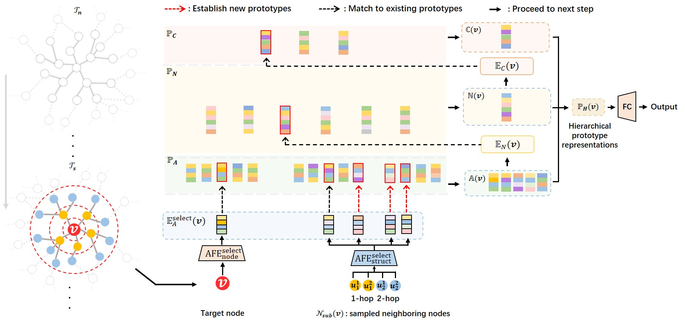

# Hierarchical Prototype Networks for Continual Graph Representation Learning (HPNs)

Implementations of Hierarchical Prototype Networks for Continual Graph Representation Learning. [paper](https://arxiv.org/abs/2111.15422)

<div align="center">
    
</div>

## Dependencies
Our final test was done with the following configurations. However, early versions of these packages may also work.

* Numpy == 1.19.1
* PyTorch == 1.7.1
* ogb == 1.3.1
 
## Data preprocessing
On the large datasets including OGB-Arxiv and OGB-Products, to avoid wasting time on splitting the dataset into a sequence of tasks each time when running the programs, we added code to store the preprocessed data. 
If you wish to preprocess both OGB-Arxiv and OGB-Products together, please run the following command
``` shell
bash OGB_preprocess.sh
```
Or if you want to preprocess one of them, please run the following commands
``` shell
python OGB_preprocess.py --data_name ogbn-arxiv
```
``` shell
python OGB_preprocess.py --data_name ogbn-products
```
## Run experiments

### run experiments on Cora
``` shell
bash run_cora.sh
```
### run experiments on Citeseer
``` shell
bash run_citeseer.sh
```
### run experiments on Actor
``` shell
bash run_actor.sh
```
### run experiments on OGB-Arxiv
``` shell
bash run_arxiv.sh
```
### run experiments on OGB-Products
``` shell
bash run_products.sh
```


